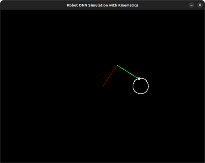
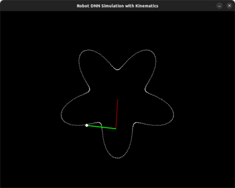
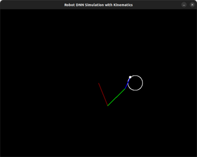
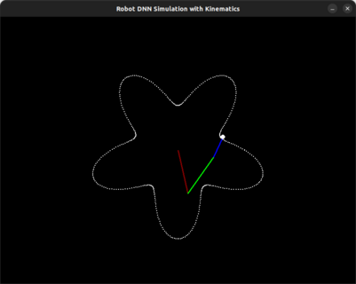

# 2R-3R-PlanarManipulatorIK-DNN
Tutorial resource using neural nets to learn the inverse kinematics function of 2R and 3R planar manipulators. Implementations in both PyTorch and Tensorflow. Rendered in PyGame.

Two example trajectories are included for each the 2R manipulator and 3R manipulator.

Requires PyTorch [or TensorFlow], NumPy, and PyGame.

**Note: Not intended to be used with PyTorch and TensorFlow both installed in the same environment.**

### References
[1] Forward and Reverse Kinematics for 3R Planar Manipulator, Date accessed: August 15, 2024, from https://hive.blog/hive-196387/@juecoree/forward-and-reverse-kinematics-for-3r-planar-manipulator

[2] Using Neural Network to Control the Robot Arm (FK, IK, Trajectory Planning), Data accessed: August 15, 2024, from https://www.youtube.com/watch?v=5FD9jyy5eek

[3] Kumar, V. "Kinematics of a planar 3R manipulator" Date accessed: August 15, 2024, from https://citeseerx.ist.psu.edu/document?repid=rep1&type=pdf&doi=d875497e3d8e2f313112d6d20426ba9986b90d
